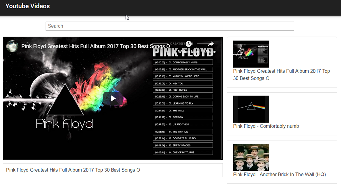

# youtube-videos

Node.js application to search and view Youtube content using the Youtube API.


### Prerequisites

You will need the following:
```
Node.js w/ npm
A YouTube API key
```

### Getting the YouTube API key

Head to https://console.cloud.google.com and login to your Google account. In the navigation menu on the left for your project (you may have to make a new project), hover over ```APIs & Services``` then click on ```Credentials```. Click ```Create Credentials``` on the new screen and select ```help me choose```. Fill out the form for ```Youtube Data API```, selecting ```web server``` for the context. You'll get your own API key that you can copy and paste into the app.

### Installing

Copy the youtube-videos-master folder to your local drive.

With the Youtube API key, go to ```./src/.env/``` and rename the ```config_example.js``` to ```config.js```. Open the file and add your key to the variable ```API_KEY```

```javascript
  const API_KEY = '<your-api-key>';

  export default API_KEY;
```

Then to your favorite terminal and run the following commands in the main directory:
```
  npm install
  npm start
```

## Usage
When everything is up and running, you should see the following at ```http://localhost:3000/```:



You can search for different videos in the search bar and play media as per the normal Youtube interface.

## Troubleshooting

**Q**: Videos aren't playing!

**A**: Try disabling any ad-blockers you have enabled. If your browser does not support HTML5, please switch to a modern one.

## Contributors

* **[Inessa Luerce](https://github.com/inessadl)**

  * Author and maintainer
  * Most features developed


* **[pghu](https://github.com/pghu)**

  * Improved readme file
